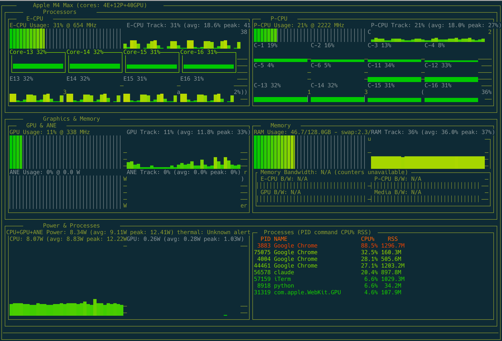

# agtop

Apple GPU Top for Apple Silicon.



## Project Status

`agtop` is an independent hard fork with its own release cycle and maintenance policy.

Origin attribution: this project is inspired by `tlkh/asitop` and is now refactored to a new utility as `binlecode/agtop`.

## At a Glance

- Platform: Apple Silicon macOS with `powermetrics` available.
- Permission model: runtime requires `sudo` because `powermetrics` is privileged.
- Core value: combines CPU/GPU/ANE/power/memory/bandwidth/process signals in one terminal dashboard.
- Compatibility model: explicit M1-M4 support plus tiered fallback for future Apple Silicon names.

## Key Features

- Unified telemetry stack: `powermetrics` + `psutil` + `sysctl` + `system_profiler`.
- Real-time dashboard: E/P CPU clusters, optional per-core gauges/history, GPU, ANE, RAM/swap, and memory bandwidth.
- Diagnosis-oriented status line: thermal state, bandwidth saturation, swap growth, and package power alerts.
- Process visibility: top CPU/RSS processes with optional regex filter (`--proc-filter`).
- Profile-aware scaling: `--power-scale auto|profile` for consistent chart interpretation across SoC classes.

## Installation

This project uses the source repo itself as the tap remote (not a separate `homebrew-*` tap repo).

```shell
brew tap --custom-remote binlecode/agtop https://github.com/binlecode/agtop.git
brew install binlecode/agtop/agtop
```

### Upgrade / Uninstall

```shell
brew update
brew upgrade binlecode/agtop/agtop
brew uninstall binlecode/agtop/agtop
```

## Quick Start

```shell
agtop --help
sudo agtop
sudo agtop --interval 1 --avg 30 --power-scale profile
sudo agtop --show_cores --core-view both --interval 1 --avg 30 --power-scale profile
sudo agtop --proc-filter "python|ollama|vllm|docker|mlx"
sudo agtop --alert-bw-sat-percent 90 --alert-package-power-percent 85 --alert-swap-rise-gb 0.5 --alert-sustain-samples 4
```

## CLI Quick Reference

| Option | Purpose | Default |
| --- | --- | --- |
| `--interval` | Dashboard and sampling interval (seconds) | `1` |
| `--avg` | Rolling average window (seconds) | `30` |
| `--show_cores` | Enable per-core panels | `off` |
| `--core-view gauge\|history\|both` | Per-core visualization mode when cores are shown | `gauge` |
| `--power-scale auto\|profile` | Power chart scaling mode | `auto` |
| `--proc-filter REGEX` | Filter process panel command names | empty |
| `--alert-bw-sat-percent` | Sustained bandwidth saturation threshold | `85` |
| `--alert-package-power-percent` | Sustained package-power threshold (profile-relative) | `85` |
| `--alert-swap-rise-gb` | Swap-growth threshold over sustained samples | `0.3` |
| `--alert-sustain-samples` | Consecutive samples required for sustained alerts | `3` |

## Telemetry Model (What / How / Why)

| Signal Domain | Primary Source | Why |
| --- | --- | --- |
| CPU utilization (per-core/cluster) | `psutil` | Aligns better with Activity Monitor / btop-style load semantics |
| CPU/GPU freq, ANE power, CPU/GPU/package power, thermal, bandwidth | `powermetrics` plist | Apple-specific counters are not fully available from generic CPU APIs |
| SoC identity and profile hints | `sysctl`, `system_profiler`, built-in SoC profiles | Stable scaling defaults and compatibility across chip families |

Practical result: `agtop` is built for Apple Silicon diagnosis where CPU load behavior should feel familiar while still exposing Apple-only accelerator and bandwidth counters.

## Troubleshooting

- `Failed to start powermetrics due to missing sudo privileges`:
  run with `sudo agtop`.
- `powermetrics` not found:
  verify you are on macOS with `powermetrics` available in PATH.
- Metric differences versus other tools:
  small differences are expected due to sampling windows and source timing.

## Development

Install local dev dependencies (repo `.venv`):

```bash
.venv/bin/python -m pip install -e ".[dev]"
```

Validate CLI and run the app in development:

```bash
.venv/bin/python -m agtop.agtop --help
sudo .venv/bin/python -m agtop.agtop --interval 1 --avg 30 --power-scale profile
sudo .venv/bin/python -m agtop.agtop --show_cores --core-view both --interval 1 --avg 30 --power-scale profile
```

Run tests:

```bash
.venv/bin/python -m pytest -q
```

Run lint + format:

```bash
.venv/bin/python -m ruff check .
.venv/bin/python -m ruff format .
```

## Maintainer Release (Homebrew Tap)

### Topology

- Source repo: `binlecode/agtop`
- Tap repo: `binlecode/homebrew-agtop`
- Tap users run: `binlecode/agtop`
- Formula name: `agtop`

Homebrew upgrades come from the tap formula, not from `pyproject.toml` alone.

### One-Time Tap Repo Setup

```bash
export GH_USER="binlecode"
export TAP_REPO="$GH_USER/homebrew-agtop"

brew tap-new "$TAP_REPO"
gh repo create "$TAP_REPO" --public --source "$(brew --repository "$TAP_REPO")" --push
```

### Release Flow (split CI/CD)

1. Update `pyproject.toml` (`[project].version`) and `CHANGELOG.md`, then commit.
   CI does not bump versions.
2. Create and push matching tag and commit.
   CI does not create tags.

```bash
export VERSION="0.1.7"
git add pyproject.toml CHANGELOG.md
git commit -m "Release v$VERSION"
git tag "v$VERSION"
git push origin main "v$VERSION"
```

3. `.github/workflows/main-ci.yml` runs on `main` push:
   resolves Python version from `Formula/agtop.rb`, prepares `.ci-venv`, installs formula resource versions, then runs checks.
4. `.github/workflows/release-formula.yml` runs on `v*` tags:
   verifies tag/version match, updates `Formula/agtop.rb` tarball `url` + `sha256`, and commits formula sync to `main`.

5. Validate availability:

```bash
brew update
brew upgrade binlecode/agtop/agtop
brew info binlecode/agtop/agtop
```

## Compatibility Notes

- Chip families `M1` through `M4` are recognized directly.
- Unknown future Apple Silicon names fall back to tier defaults (`base`, `Pro`, `Max`, `Ultra`).
- Available `powermetrics` fields vary by macOS and chip generation.

Use `agtop` for install and runtime commands in this repository.
