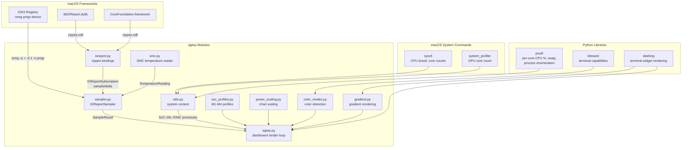

# agtop

Performance monitoring CLI for Apple Silicon.


## Background

`agtop` is an independent project with its own architecture, codebase, and release cycle. Originally inspired by `tlkh/asitop`, it has been completely redesigned and rewritten — new sampling backend, metric pipeline, dashboard rendering, and module structure.

The original `asitop` shells out to Apple's `powermetrics` CLI, a high-level tool that requires `sudo`, writes to temp files, and returns pre-aggregated metrics at a fixed cadence. `agtop` instead calls the underlying IOReport C library directly via Python ctypes — the same library that `powermetrics` itself uses internally. This low-level approach runs unprivileged, avoids subprocess and file I/O overhead, gives access to raw per-core residency states and energy counters, and lets the application control its own sampling interval and delta computation.

## Key Features

- **Real-time terminal dashboard**: live gauges and time-series charts for E-CPU and P-CPU clusters with per-core breakdown, GPU utilization and frequency, ANE power-based activity estimate, RAM/swap usage, and memory bandwidth.
- **In-process IOReport sampling**: reads Apple Silicon power, frequency, and residency metrics via Python ctypes bindings to `libIOReport.dylib` and CoreFoundation. No subprocesses, no temp files.
- **Per-core visibility**: per-core panels on by default; `--core-view gauge|history|both` controls the visualization style.
- **Diagnosis-oriented alerts**: configurable sustained-sample thresholds for thermal pressure, bandwidth saturation, swap growth, and package power. Active alerts are shown inline in the power status line.
- **Process monitoring**: top CPU/RSS processes panel with optional regex filtering (`--proc-filter`).
- **Profile-aware power scaling**: `profile` mode (default) scales charts against the SoC's known reference wattage for stable cross-session comparison; `auto` mode scales against rolling peak.
- **SoC compatibility**: 16 built-in M1–M4 profiles (base, Pro, Max, Ultra). Unknown future chips fall back to tier-based defaults using the latest generation's reference values.
- **CPU/GPU temperature**: reads die temperatures from the Apple SMC (System Management Controller) via IOKit ctypes. Displayed inline in gauge titles (e.g. "P-CPU Usage: 12% @ 3504 MHz (58°C)"). No sudo required.
- **Adaptive terminal color**: auto-detects color capability (mono, 8-color, 256-color, truecolor) and applies gradient coloring to gauges, charts, and process rows based on utilization level.

## Installation

### Homebrew (recommended)

```shell
brew tap --custom-remote binlecode/agtop https://github.com/binlecode/agtop.git
brew install binlecode/agtop/agtop
```

Upgrade / uninstall:

```shell
brew upgrade binlecode/agtop/agtop
brew uninstall binlecode/agtop/agtop
```

### pip

```shell
pip install git+https://github.com/binlecode/agtop.git
```

## Quick Start

```shell
agtop                          # full dashboard with per-core gauges, profile power scaling
agtop --core-view both         # per-core gauges + history charts
agtop --interval 1 --avg 10   # faster refresh, shorter rolling window
agtop --proc-filter "python|ollama|vllm|docker|mlx"
agtop --no-show_cores          # cluster-level view without per-core panels
```

## CLI Reference

| Option | Purpose | Default |
| --- | --- | --- |
| `--interval` | Sampling and refresh interval (seconds) | `2` |
| `--color` | Color theme (0–8) | `2` |
| `--avg` | Rolling average window (seconds) | `30` |
| `--show_cores` / `--no-show_cores` | Per-core panels | `on` |
| `--core-view gauge\|history\|both` | Per-core visualization mode | `gauge` |
| `--power-scale profile\|auto` | Power chart scaling | `profile` |
| `--proc-filter REGEX` | Filter process panel by command name | all |
| `--alert-bw-sat-percent` | Bandwidth saturation alert threshold | `85` |
| `--alert-package-power-percent` | Package power alert threshold (profile-relative) | `85` |
| `--alert-swap-rise-gb` | Swap growth alert threshold (GB) | `0.3` |
| `--alert-sustain-samples` | Consecutive samples for sustained alerts | `3` |

## How It Works

agtop accesses Apple Silicon hardware telemetry through three OS-level interfaces, all called in-process:

### IOReport framework (`libIOReport.dylib`)

The primary data source. agtop loads `libIOReport.dylib` and `CoreFoundation.framework` via `ctypes.cdll.LoadLibrary`, then:

- Subscribes to three IOReport channel groups: **Energy Model** (CPU/GPU/ANE energy in nanojoules), **CPU Core Performance States** (per-core ECPU/PCPU DVFS residency), and **GPU Performance States** (GPU DVFS residency).
- Takes periodic snapshots with `IOReportCreateSamples` and computes deltas between consecutive snapshots with `IOReportCreateSamplesDelta`.
- Extracts per-channel energy values (`IOReportSimpleGetIntegerValue`) and per-state residency tables (`IOReportStateGetCount`, `IOReportStateGetNameForIndex`, `IOReportStateGetResidency`).
- Converts raw items into a `SampleResult` — power (watts), frequency (MHz), and activity (percent). Energy values are converted from nanojoules to joules and scaled by elapsed time for correct wattage.

All CoreFoundation objects are managed via `CFRelease` to prevent memory leaks.

### IOKit registry (`ioreg`)

At startup, reads `ioreg -a -r -d 1 -n pmgr` to get DVFS frequency tables from the power manager device node. Parses `voltage-states*` binary blobs as 8-byte `(freq_hz, voltage)` pairs and heuristically assigns tables to E-CPU, P-CPU, and GPU clusters. These translate opaque `V{n}P{m}` (CPU) and `P{n}` (GPU) state names into actual MHz values, computed as weighted averages across active P-states by residency time.

### SMC (System Management Controller)

Reads CPU and GPU die temperatures via IOKit ctypes bindings to the `AppleSMC` kernel service. Discovers temperature sensor keys (Tp*/Te* for CPU, Tg* for GPU) at startup and reads `flt ` (IEEE 754 float) values each sample. Runs unprivileged.

### System context

- `sysctl`: SoC chip name, total/P/E core counts.
- `system_profiler`: GPU core count.
- `psutil`: RAM/swap usage (`virtual_memory()`, `swap_memory()`), per-core CPU utilization (primary source, Activity Monitor-aligned; IOReport residency as fallback), and process enumeration.

### Signal Sources

| Signal | Source | Notes |
| --- | --- | --- |
| CPU/GPU/ANE power (W) | IOReport Energy Model | nJ per sample interval → watts |
| Per-core frequency (MHz) | IOReport residency + DVFS tables | Weighted average of active P-states |
| Per-core activity (%) | `psutil.cpu_percent(percpu=True)` | IOReport residency as fallback |
| GPU frequency and activity | IOReport GPU Performance States | Weighted average of GPUPH residencies |
| CPU/GPU temperature (°C) | SMC via IOKit ctypes | Max die temp per cluster |
| RAM / swap | `psutil.virtual_memory()` + `psutil.swap_memory()` | `total - available` for used |
| SoC profile | `sysctl` brand → 16 M1–M4 profiles | Tier fallbacks for unknown chips |
| Top processes | `psutil.process_iter` | Optional `--proc-filter` regex |
| Bandwidth | IOReport (when available) | N/A if DCS counters not exposed |
| Thermal pressure | IOReport (when available) | "Unknown" if not exposed |

## Architecture

| Module | Role |
| --- | --- |
| `agtop/agtop.py` | CLI entry point, argument parsing, dashboard layout, main render loop with rolling averages, peak tracking, and alert evaluation |
| `agtop/ioreport.py` | ctypes bindings to `libIOReport.dylib` and CoreFoundation — `IOReportSubscription` lifecycle, snapshot, delta, and CF helpers |
| `agtop/sampler.py` | `IOReportSampler`: two-snapshot delta logic, `SampleResult` conversion, DVFS table discovery from `ioreg pmgr`, SMC temperature integration |
| `agtop/smc.py` | SMC temperature reader: IOKit ctypes bindings to `AppleSMC`, key discovery, CPU/GPU die temperature reads |
| `agtop/utils.py` | System context: `psutil` RAM/swap, `sysctl`/`system_profiler` SoC info, `psutil` CPU/processes |
| `agtop/soc_profiles.py` | 16 `SocProfile` dataclasses (M1–M4) with reference wattage/bandwidth; tier fallbacks for unknown chips |
| `agtop/power_scaling.py` | `power_to_percent()`: profile mode (SoC reference) vs auto mode (rolling peak x1.25) |
| `agtop/color_modes.py` | Terminal color detection and utilization-to-color mapping (green → yellow → orange → red) |
| `agtop/gradient.py` | `GradientHGauge`, `GradientVGauge`, `GradientHChart`, `GradientText` — per-cell ANSI truecolor rendering |



## Troubleshooting

- **Bandwidth shows N/A**: IOReport does not expose memory bandwidth counters on all SoCs.
- **Thermal shows "Unknown"**: IOReport does not expose thermal pressure state.
- **Frequencies show 0 MHz**: DVFS table discovery failed. File an issue with `sysctl -n machdep.cpu.brand_string` output.
- **Metric differences vs other tools**: expected due to sampling window and source timing differences.

## Development

```bash
.venv/bin/python -m pip install -e ".[dev]"    # install editable + dev deps
.venv/bin/python -m agtop.agtop --help         # validate CLI
.venv/bin/python -m agtop.agtop                # run with defaults
.venv/bin/pytest -q                            # run tests
.venv/bin/python -m ruff check . && .venv/bin/python -m ruff format .   # lint + format
```

## Release

See `GUIDE-release-operations.md` for the full runbook.

```bash
# 1. Bump version and changelog
edit pyproject.toml CHANGELOG.md

# 2. Run checks
.venv/bin/python -m ruff check --fix . && .venv/bin/python -m ruff format .
.venv/bin/python -m agtop.agtop --help
.venv/bin/pytest -q

# 3. Commit and tag
git add pyproject.toml CHANGELOG.md
git commit -m "Release v$VERSION"
scripts/tag_release.sh "$VERSION"

# 4. Verify
brew update && brew upgrade binlecode/agtop/agtop
```

CI handles formula sync automatically on tag push.
