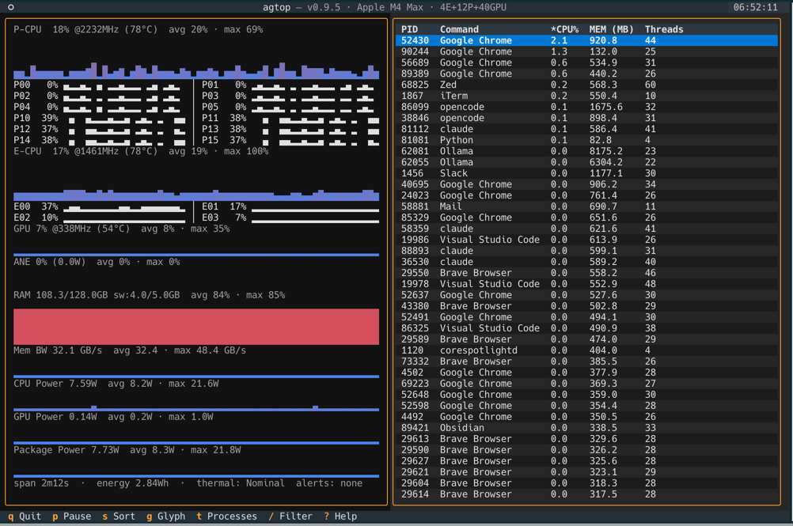
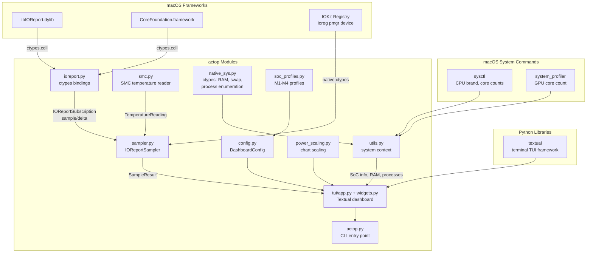

# actop

**Watch your Apple Silicon Mac the way it actually works — and profile your own workloads from Python.**

`actop` is a sudoless, in-process performance monitor for M1–M4 Macs: a real-time
TUI for CPU/GPU/ANE utilization, per-core frequency, memory **bandwidth**, power,
and thermals — plus a **Python API** (`Monitor` / `Profiler`, `to_pandas()`) so you
can instrument your *own* local LLM / MLX / CoreML inference and training runs with
SoC-accurate power and energy context.

<!-- TODO: replace the static screenshot below with an animated capture (GIF/SVG) of
     the dashboard live during an MLX/Ollama inference run — motion is what gets shared. -->


**Who it's for**

- **Running LLMs locally** (MLX, llama.cpp, Ollama) and want to see whether you're
  GPU-bound, memory-**bandwidth**-bound, or leaving the ANE idle — at a glance.
- **Profiling your own code**: wrap a workload in `Monitor`/`Profiler`, get a
  pandas frame of power, frequency, residency, and cumulative session energy.
- **Just want a clean `*top`** for Apple Silicon that needs **no `sudo`**.

Install in one line — [Homebrew](#homebrew-recommended) or [uv](#uv-recommended-for-non-homebrew-users) — then run `actop`.

## Background

`actop` is an independent project with its own idea, architecture, codebase, and release cycle. It was inspired by `tlkh/asitop` — built to fill the gaps that tool left for whole-chip, sudoless, programmable monitoring. The name carries the Unix `*top` lineage: `actop` (*Apple **C**hip top*) follows `asitop` (*Apple Silicon top*), and covers the whole SoC — CPU, GPU, ANE, power, memory bandwidth, and thermal.

The original `asitop` shells out to Apple's `powermetrics` CLI, a high-level tool that requires `sudo`, writes to temp files, and returns pre-aggregated metrics at a fixed cadence. `actop` instead calls the underlying IOReport C library directly via Python ctypes — the same library that `powermetrics` itself uses internally. This low-level approach runs unprivileged, avoids subprocess and file I/O overhead, gives access to raw per-core residency states and energy counters, and lets the application control its own sampling interval and delta computation.

**Why another `*top`?** `mactop` (Go) and `macmon` (Rust) are excellent sudoless TUIs — mactop the broadest in features, macmon the leanest binary. `actop`'s reason to exist is different: it is the **programmable, Python-native** one. A public API (`Monitor` / `Profiler`, `to_pandas()`) lets you instrument and profile your *own* workloads — local LLM / CoreML / MLX inference, training loops — from Python, with SoC-accurate power context and cumulative session energy. It's the data scientist's profiler, not just a dashboard — and unlike the `sudo`-bound `asitop` that inspired it, it needs no `sudo`. See [Where actop fits](#where-actop-fits) for the head-to-head.

## Key Features

- **Textual TUI dashboard**: `Sparkline` charts for E-CPU, P-CPU, GPU, ANE, RAM, and power — rendered by the [Textual](https://textual.textualize.io/) framework. Supports `dots` (braille) and `block` glyph styles. Resizes cleanly; no raw ANSI escape sequences.
- **In-process IOReport sampling**: reads Apple Silicon power, frequency, and residency metrics via Python ctypes bindings to `libIOReport.dylib` and CoreFoundation. No subprocesses, no temp files.
- **Per-core visibility**: per-core panels on by default; toggle with `--no-show_cores` for a cluster-level view.
- **Diagnosis-oriented alerts**: configurable sustained-sample thresholds for thermal pressure, bandwidth saturation, swap growth, and package power. Active alerts are shown inline in the status line.
- **Process monitoring (optional)**: top CPU/RSS processes panel is off by default. Enable at launch with `--show-processes` or press `t` in the TUI. Regex filtering is available via `--proc-filter` or `/` interactively.
- **Profile-aware power scaling**: `profile` mode (default) scales charts against the SoC's known reference wattage for stable cross-session comparison; `auto` mode scales against rolling peak.
- **SoC compatibility**: 16 built-in M1–M4 profiles (base, Pro, Max, Ultra). Unknown future chips fall back to tier-based defaults using the latest generation's reference values.
- **CPU/GPU temperature**: reads die temperatures from the Apple SMC (System Management Controller) via IOKit ctypes. Displayed inline in gauge titles (e.g. "P-CPU Usage: 12% @ 3504 MHz (58°C)"). No sudo required.

## Where actop fits

How the sudoless, in-process field stacks up:

| | actop | [mactop](https://github.com/metaspartan/mactop) | [macmon](https://github.com/vladkens/macmon) |
|---|:---:|:---:|:---:|
| Unprivileged, in-process (no sudo) | ✅ | ✅ | ✅ |
| CPU/GPU/ANE power · temps · bandwidth | ✅ | ✅ | ✅ |
| Per-process power/energy attribution (`PWR` column) | ✅ | — | — |
| Bandwidth % of SoC peak + `MEM-BOUND` saturation alert | ✅ | — | — |
| Throttle-state indicator (`THROTTLING:CPU/GPU`) | ✅ | — | — |
| DVFS P-state residency distribution (per-cluster) | ✅ | — | — |
| Python API (`Monitor`/`Profiler`, `to_pandas()`) | ✅ | — | — |
| SoC-accurate power scaling (M1–M4 profiles) | ✅ | rolling peak | rolling peak |
| Session energy (∫ package power) | ✅ | — | — |
| Net/disk I/O · fan RPM · menu bar | — | ✅ | fan only |

For the broadest TUI and DevOps feature set (network/disk I/O, a menu-bar app, more export formats), use **mactop**; for the leanest single Rust binary, **macmon**. Full head-to-head: [docs/REVIEW-architecture-comparison.md](docs/REVIEW-architecture-comparison.md).

## Installation

### Homebrew (recommended)

```shell
brew tap binlecode/actop
brew install binlecode/actop/actop
```

The tap name `binlecode/actop` resolves to the formula repo
[`binlecode/homebrew-actop`](https://github.com/binlecode/homebrew-actop) (Homebrew's
`user/repo` → `github.com/user/homebrew-repo` convention). The formula is
self-contained: it depends on Homebrew's `python@3.13` and installs `actop` into its
own isolated `libexec` virtualenv — it does **not** use (or interfere with) the macOS
system Python.

Upgrade / uninstall:

```shell
brew upgrade binlecode/actop/actop
brew uninstall binlecode/actop/actop && brew untap binlecode/actop
```

### uv (recommended for non-Homebrew users)

[`uv`](https://docs.astral.sh/uv/) installs `actop` into a sandboxed, per-tool
environment with its own managed CPython — no system Python required and no
interpreter drift:

```shell
uv tool install git+https://github.com/binlecode/actop.git
```

Upgrade / uninstall:

```shell
uv tool upgrade actop
uv tool uninstall actop
```

### pip

```shell
pip install git+https://github.com/binlecode/actop.git
```

## Quick Start

```shell
actop                                               # full dashboard with per-core panels, profile power scaling
actop --interval 1 --avg 10                        # faster refresh, shorter rolling window
actop --show-processes                              # include top process panel at startup
actop --proc-filter "python|ollama|vllm|docker|mlx"  # filter process panel at launch
actop --no-show_cores                               # cluster-level view without per-core panels
actop --chart-glyph block                           # square block chart glyphs
actop --json                                        # stream NDJSON metrics to stdout (no TUI)
actop --serve 9095                                  # serve Prometheus metrics at :9095/metrics (no TUI)
```

Interactive keys: `p` pause · `s` cycle sort (CPU%→RSS→PID) · `g` toggle chart glyph (`dots`/`block`) · `t` toggle process panel · `/` filter processes · `?` help overlay · `q` quit

## Python API

Wrap any workload to get a pandas frame of power/frequency/residency/energy — no TUI needed:

```python
from actop import Profiler

with Profiler() as p:
    run_my_inference()

df = p.to_pandas()   # rows = samples; cols = power/freq/residency/energy
```

`to_pandas()` needs the `pandas` extra: `pip install "actop[pandas]"`. For a single point-in-time reading instead of a background collector, use `Monitor().get_snapshot()`.

## CLI Reference

| Option | Purpose | Default |
| --- | --- | --- |
| `--interval` | Sampling and refresh interval (seconds) | `2` |
| `--avg` | Rolling average window (seconds) | `30` |
| `--subsamples` | Internal sampler deltas per interval (≥1) | `1` |
| `--show_cores` / `--no-show_cores` | Per-core panels | `on` |
| `--show-processes` | Show top process panel at startup | `off` |
| `--power-scale profile\|auto` | Power chart scaling | `profile` |
| `--chart-glyph dots\|block` | Chart glyph style | `dots` |
| `--proc-filter REGEX` | Filter process panel by command name | all (applies when panel is enabled) |
| `--alert-bw-sat-percent` | Bandwidth saturation alert threshold | `85` |
| `--alert-package-power-percent` | Package power alert threshold (profile-relative) | `85` |
| `--alert-swap-rise-gb` | Swap growth alert threshold (GB) | `0.3` |
| `--alert-sustain-samples` | Consecutive samples for sustained alerts | `3` |
| `--json` | Stream metrics as NDJSON to stdout instead of the TUI | `off` |
| `--serve PORT` | Serve Prometheus metrics on `http://0.0.0.0:PORT/metrics` instead of the TUI | `off` |

## Metrics Export

Beyond the interactive dashboard, actop can act as an observability source. Both
modes reuse the same unprivileged IOReport backend and exit on `Ctrl-C`.

- **NDJSON stream** (`--json`): emits one compact JSON snapshot per `--interval`
  to stdout — every `SystemSnapshot` field, including per-core lists. Pipe it to
  `jq`, a log shipper, or a file:

  ```shell
  actop --json --interval 1 | jq '{cpu: .cpu_watts, pkg: .package_watts}'
  ```

- **Prometheus endpoint** (`--serve PORT`): exposes gauges at `/metrics`
  (`actop_cpu_power_watts`, `actop_pcpu_utilization_percent`, per-core
  `actop_core_utilization_percent{cluster,core}`, …). A background sampler keeps
  the latest reading warm so scrapes return immediately:

  ```shell
  actop --serve 9095
  curl -s localhost:9095/metrics
  ```

## How It Works

actop accesses Apple Silicon hardware telemetry through three OS-level interfaces, all called in-process:

### IOReport framework (`libIOReport.dylib`)

The primary data source. actop loads `libIOReport.dylib` and `CoreFoundation.framework` via `ctypes.cdll.LoadLibrary`, then:

- Subscribes to three IOReport channel groups: **Energy Model** (CPU/GPU/ANE energy in nanojoules), **CPU Core Performance States** (per-core ECPU/PCPU DVFS residency), and **GPU Performance States** (GPU DVFS residency).
- Takes periodic snapshots with `IOReportCreateSamples` and computes deltas between consecutive snapshots with `IOReportCreateSamplesDelta`.
- Extracts per-channel energy values (`IOReportSimpleGetIntegerValue`) and per-state residency tables (`IOReportStateGetCount`, `IOReportStateGetNameForIndex`, `IOReportStateGetResidency`).
- Converts raw items into a `SampleResult` — power (watts), frequency (MHz), and activity (percent). Energy values are converted from nanojoules to joules and scaled by elapsed time for correct wattage.

All CoreFoundation objects are managed via `CFRelease` to prevent memory leaks.

### IOKit registry (`ioreg`)

At startup, reads `ioreg -a -r -d 1 -n pmgr` to get DVFS frequency tables from the power manager device node. Parses `voltage-states*` binary blobs as 8-byte `(freq_hz, voltage)` pairs and heuristically assigns tables to E-CPU, P-CPU, and GPU clusters. These translate opaque `V{n}P{m}` (CPU) and `P{n}` (GPU) state names into actual MHz values, computed as weighted averages across active P-states by residency time.

### SMC (System Management Controller)

Reads CPU and GPU die temperatures via IOKit ctypes bindings to the `AppleSMC` kernel service. Discovers temperature sensor keys (Tp*/Te* for CPU, Tg* for GPU) at startup and reads `flt ` (IEEE 754 float) values each sample. Runs unprivileged.

### Thermal pressure (`NSProcessInfo`)

Reads the macOS thermal state via the Objective-C runtime (`libobjc.A.dylib` + `Foundation.framework`) using ctypes. Calls `[NSProcessInfo processInfo].thermalState` each sample. The result is shown in the status line above the per-core history tracks:

| State | Meaning |
| --- | --- |
| **Nominal** | Normal operating conditions — no throttling |
| **Fair** | Mild thermal pressure — light throttling may begin |
| **Serious** | Significant thermal pressure — noticeable throttling in effect |
| **Critical** | Severe thermal pressure — aggressive throttling, system is very hot |

No sudo required. Degrades to `Unknown` if the ObjC runtime call fails.

### System context

- `sysctl`: SoC chip name, total/P/E core counts.
- `system_profiler`: GPU core count.
- Native `ctypes` (`native_sys.py`): RAM/swap usage (Mach VM stats, `XSWUsage`) and process enumeration (`proc_listpids`/`proc_pidinfo`) — no `psutil`.

### Signal Sources

| Signal | Source | Notes |
| --- | --- | --- |
| CPU/GPU/ANE power (W) | IOReport Energy Model | nJ per sample interval → watts |
| Per-core frequency (MHz) | IOReport residency + DVFS tables | Weighted average of active P-states |
| Per-core activity (%) | IOReport CPU Core Performance States | Via `CoreSample` (residency-weighted active%) |
| GPU frequency and activity | IOReport GPU Performance States | Weighted average of GPUPH residencies |
| CPU/GPU temperature (°C) | SMC via IOKit ctypes | Max die temp per cluster |
| RAM / swap | Native `ctypes` (`host_statistics64` + `XSWUsage`) | `total - available` for used |
| SoC profile | `sysctl` brand → 16 M1–M4 profiles | Tier fallbacks for unknown chips |
| Top processes | Native `ctypes` (`proc_listpids`/`proc_pidinfo`) | Optional `--proc-filter` regex |
| Bandwidth | IOReport (when available) | N/A if DCS counters not exposed |
| Thermal pressure | `NSProcessInfo.thermalState` via ObjC runtime | Nominal / Fair / Serious / Critical |

## Architecture

| Module | Role |
| --- | --- |
| `actop/actop.py` | CLI entry point and argument parsing; thin wrapper launching the Textual TUI |
| `actop/ioreport.py` | ctypes bindings to `libIOReport.dylib` and CoreFoundation — `IOReportSubscription` lifecycle, snapshot, delta, and CF helpers |
| `actop/sampler.py` | `IOReportSampler`: two-snapshot delta logic, `SampleResult` conversion, DVFS table discovery from `ioreg pmgr`, SMC temperature integration |
| `actop/smc.py` | SMC temperature reader: IOKit ctypes bindings to `AppleSMC`, key discovery, CPU/GPU die temperature reads |
| `actop/utils.py` | System context: native `ctypes` RAM/swap and process enumeration (via `native_sys.py`), `sysctl`/`system_profiler` SoC info |
| `actop/soc_profiles.py` | 16 `SocProfile` dataclasses (M1–M4) with reference wattage/bandwidth; tier fallbacks for unknown chips |
| `actop/power_scaling.py` | `power_to_percent()`: profile mode (SoC reference) vs auto mode (rolling peak x1.25) |
| `actop/config.py` | `DashboardConfig` frozen dataclass; `create_dashboard_config()` merges CLI args with SoC info |
| `actop/models.py` | `SystemSnapshot` and `CoreSample` dataclasses (public API types) |
| `actop/api.py` | `Monitor`, `Profiler`, `AsyncMonitor` — public Python API for hardware profiling |
| `actop/tui/app.py` | `ActopApp`: Textual `App` with polling worker, process table, interactive sort/filter/pause |
| `actop/tui/widgets.py` | `HardwareDashboard` widget with braille `Sparkline` charts, core rows, and alert computation |
| `actop/tui/styles.tcss` | Textual CSS layout for the dashboard |


```mermaid
graph TD
    subgraph "macOS Frameworks"
        IOR[libIOReport.dylib]
        CF[CoreFoundation.framework]
        IOKIT[IOKit Registry<br/>ioreg pmgr device]
    end

    subgraph "macOS System Commands"
        SYSCTL[sysctl<br/>CPU brand, core counts]
        SYSPROF[system_profiler<br/>GPU core count]
    end

    subgraph "Python Libraries"
        TEXTUAL[textual<br/>terminal TUI framework]
    end

    subgraph "actop Modules"
        IORPY[ioreport.py<br/>ctypes bindings]
        SAMPLER[sampler.py<br/>IOReportSampler]
        SMC[smc.py<br/>SMC temperature reader]
        NATIVESYS[native_sys.py<br/>ctypes: RAM, swap,<br/>process enumeration]
        UTILS[utils.py<br/>system context]
        PROFILES[soc_profiles.py<br/>M1-M4 profiles]
        POWER[power_scaling.py<br/>chart scaling]
        CONFIG[config.py<br/>DashboardConfig]
        TUI[tui/app.py + widgets.py<br/>Textual dashboard]
        MAIN[actop.py<br/>CLI entry point]
    end

    IOR -->|ctypes.cdll| IORPY
    CF -->|ctypes.cdll| IORPY
    IOKIT -->|native ctypes| SAMPLER

    IORPY -->|IOReportSubscription<br/>sample/delta| SAMPLER
    SMC -->|TemperatureReading| SAMPLER
    SAMPLER -->|SampleResult| TUI

    SYSCTL --> UTILS
    SYSPROF --> UTILS
    NATIVESYS --> UTILS
    UTILS -->|SoC info, RAM, processes| TUI

    PROFILES --> CONFIG
    CONFIG --> TUI
    POWER --> TUI
    TEXTUAL --> TUI
    TUI --> MAIN
```

## Troubleshooting

- **Bandwidth shows N/A**: IOReport does not expose memory bandwidth counters on all SoCs.
- **Thermal shows "Unknown"**: ObjC runtime failed to read `NSProcessInfo.thermalState` (unexpected on macOS 12+).
- **Frequencies show 0 MHz**: DVFS table discovery failed. File an issue with `sysctl -n machdep.cpu.brand_string` output.
- **Metric differences vs other tools**: expected due to sampling window and source timing differences.
- **ANE reads `0% (0.0W)`**: expected when idle — the Neural Engine is power-gated unless an app runs CoreML inference. To confirm the gauge works, drive a load with `scripts/ane_load.py` (see Development) or trigger on-device ML (Photos library scan, Live Text, dictation). Note: MLX/Ollama/llama.cpp use the **GPU**, not the ANE.

## Development

```bash
.venv/bin/python -m pip install -e ".[dev]"    # install editable + dev deps
.venv/bin/python -m actop.actop --help         # validate CLI
.venv/bin/python -m actop.actop                # run with defaults
.venv/bin/pytest -q                            # run tests
.venv/bin/python -m ruff check . && .venv/bin/python -m ruff format .   # lint + format
```

### Exercising the ANE gauge

The Neural Engine idles at `0% (0.0W)` unless something runs CoreML inference.
`scripts/ane_load.py` generates a deterministic ANE load so you can verify the
gauge. Its deps (`coremltools`, `numpy`) are macOS-only and heavy, so they live
in a separate `ane` extra — deliberately kept out of `dev` so Linux CI stays lean.

```bash
.venv/bin/python -m pip install -e ".[ane]"     # one-time, macOS only
.venv/bin/python scripts/ane_load.py --duration 60   # then watch actop's ANE gauge
```

## Release

See `GUIDE-release-operations.md` for the full runbook.

```bash
# 1. Bump version and changelog
edit pyproject.toml CHANGELOG.md

# 2. Run checks
.venv/bin/python -m ruff check --fix . && .venv/bin/python -m ruff format .
.venv/bin/python -m actop.actop --help
.venv/bin/pytest -q

# 3. Commit and tag
git add pyproject.toml CHANGELOG.md
git commit -m "Release v$VERSION"
scripts/tag_release.sh "$VERSION"

# 4. Verify
brew update && brew upgrade binlecode/actop/actop
```

CI handles formula sync automatically on tag push.
